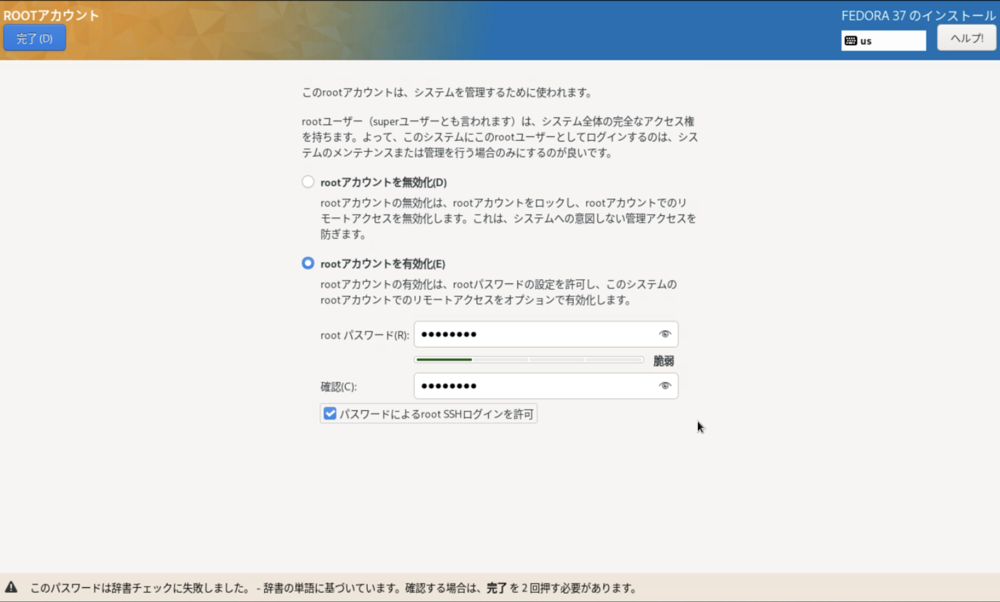

# 管理クライアント構築

CLI の作業は全て `root` ユーザで作業を実施すること。

## Fedora 構築

- 以下の構成で Fedora を 1 台構築する。
  - 仮想マシンスペック
    - CPU: 2 core
    - Mem: 4 GB
    - Disk: 80 GB
  - インストールメディア
    - Fedora-Server-dvd-x86_64-37-1.7.iso

- インストール時に以下を設定する
  - root アカウントを有効化
  - パスワードによるroot SSHログインを許可
  - 
  - 

## 共通設定作業

- [共通設定作業](50-common.md) を実施する。

## kubectl インストール

- 管理クライアントから Kubernetes の操作を行えるようにするため kubectl をインストールする。

  ```bash
  # リポジトリ追加
  cat <<EOF | tee /etc/yum.repos.d/kubernetes.repo
  [kubernetes]
  name=Kubernetes
  baseurl=https://pkgs.k8s.io/core:/stable:/v1.28/rpm/
  enabled=1
  gpgcheck=1
  gpgkey=https://pkgs.k8s.io/core:/stable:/v1.28/rpm/repodata/repomd.xml.key
  EOF
  
  cat /etc/yum.repos.d/kubernetes.repo
  
  # kubectl をインストール
  dnf install -y kubectl
  ```

## GUIインストール

- 管理クライアントから Web ブラウザで動作確認を行うため、 GUI をインストールする。

  ```bash
  # ユーザ追加
  adduser portal
  passwd portal
  
  # GUI インストール
  dnf group list
  dnf install -y @cinnamon-desktop-environment
  systemctl set-default graphical.target
  
  # 再起動
  shutdown -r now
  ```

  - portal
    - 管理クライアント上に作成する一般ユーザのユーザ名

  再起動後、コンソールに接続し GUI で起動できていることを確認する。 \
  また、上記コマンドで作成した ユーザ・パスワード でGUIにログインできることを確認する。

  - 
  - 

