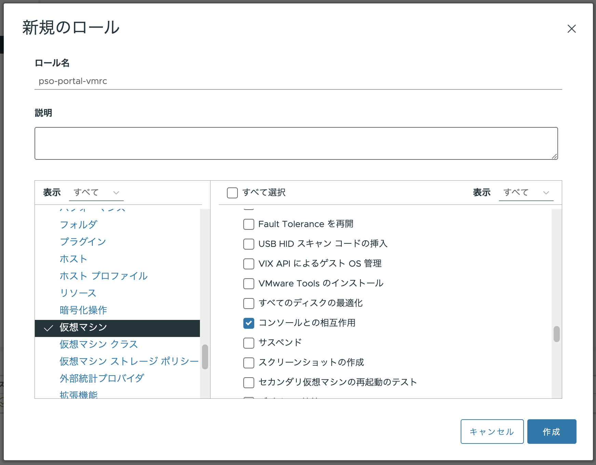
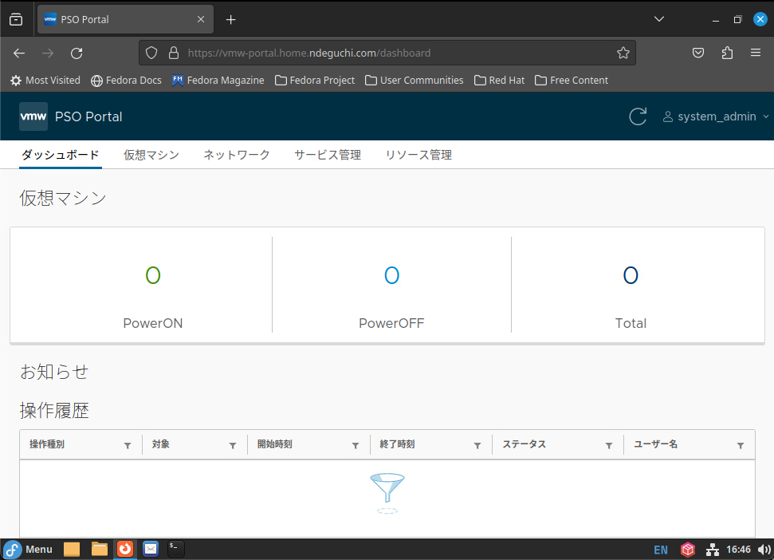
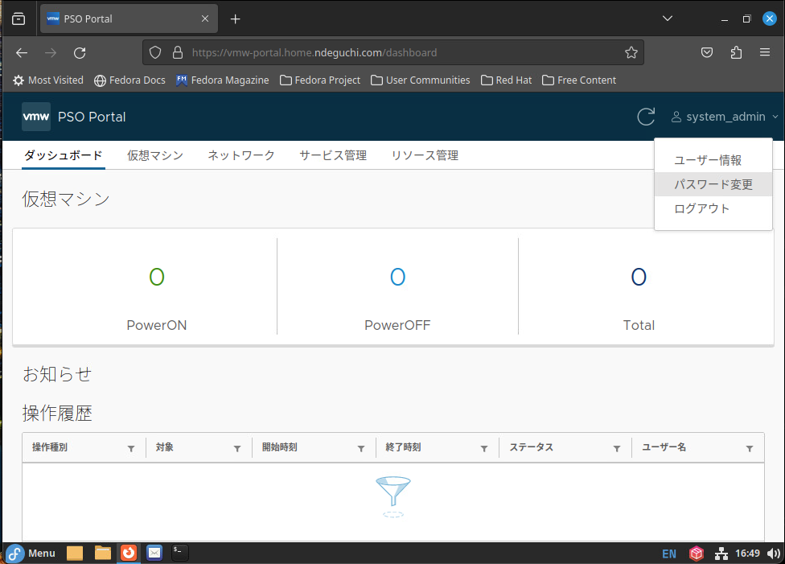
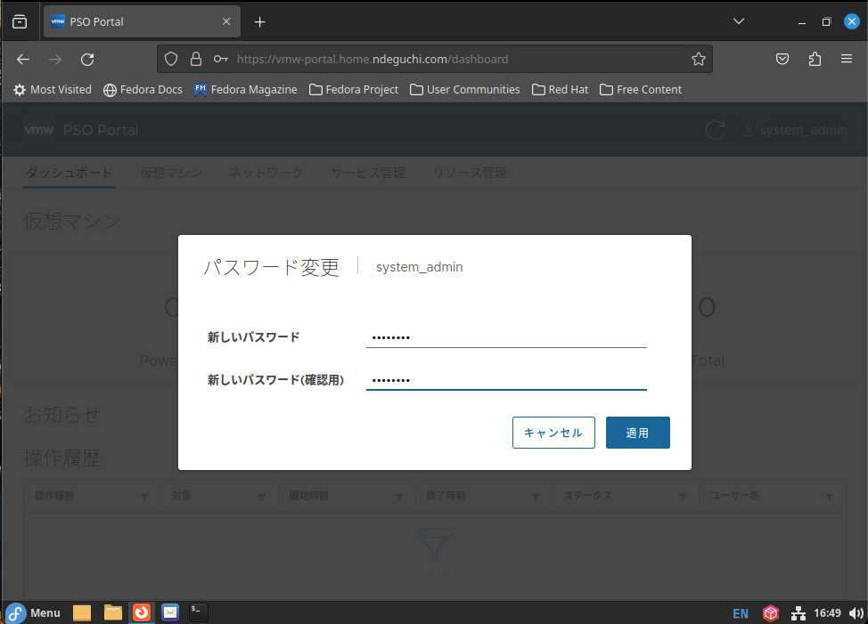
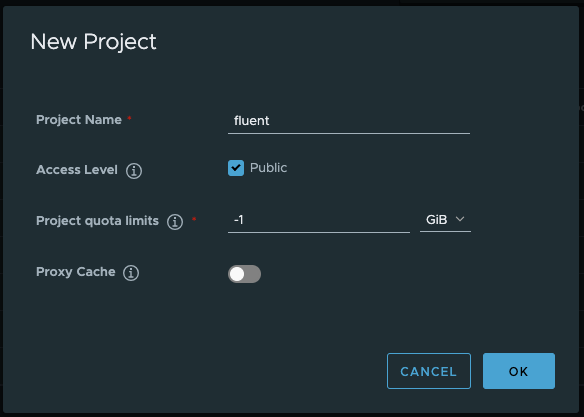

# PSO Portal Deploy

## NFS サーバを構築

- Portal の PostgreSQL のデータを Kubernetes 外部で保持するため、 Harbor を構築している Fedora 上に NFS サーバを構築する。 \
  他の NFS サービスを利用する方針でも問題無いが、 権限 `rw,no_root_squash` を付与すること。 \
  作業実施サーバ: Harbor **(注意)**

  ```bash
  cat <<EOF > /etc/exports
  /nfsshare 192.168.0.0/16(rw,no_root_squash)
  EOF
  ```

  - 192.168.0.0/16
    - NFS サーバを公開するネットワークアドレス

  ```bash
  cat /etc/exports
  
  mkdir -p /nfsshare/vmw-pso-portal-postgres
  
  systemctl status rpcbind nfs-server
  systemctl enable --now rpcbind nfs-server
  systemctl status rpcbind nfs-server
  ```

  - 確認観点：rpcbind, nfs-server が `active` であること

    ```text
    <出力例>
    ● rpcbind.service - RPC Bind
         Loaded: loaded (/usr/lib/systemd/system/rpcbind.service; enabled; preset: disabled)
         Active: active (running) since Mon 2024-01-01 22:35:55 JST; 2s ago
    TriggeredBy: ● rpcbind.socket
           Docs: man:rpcbind(8)
       Main PID: 19881 (rpcbind)
          Tasks: 1 (limit: 9463)
         Memory: 1.7M
            CPU: 17ms
         CGroup: /system.slice/rpcbind.service
                 └─19881 /usr/bin/rpcbind -w -f
    
     1月 01 22:35:55 harbor2 systemd[1]: Starting rpcbind.service - RPC Bind...
     1月 01 22:35:55 harbor2 systemd[1]: Started rpcbind.service - RPC Bind.
    
    ● nfs-server.service - NFS server and services
         Loaded: loaded (/usr/lib/systemd/system/nfs-server.service; enabled; preset: disabled)
        Drop-In: /run/systemd/generator/nfs-server.service.d
                 └─order-with-mounts.conf
         Active: active (exited) since Mon 2024-01-01 22:35:56 JST; 1s ago
        Process: 19892 ExecStartPre=/usr/sbin/exportfs -r (code=exited, status=0/SUCCESS)
        Process: 19893 ExecStart=/usr/sbin/rpc.nfsd (code=exited, status=0/SUCCESS)
        Process: 19913 ExecStart=/bin/sh -c if systemctl -q is-active gssproxy; then systemctl reload gssproxy ; fi (code=exited, status=0/SUCCESS)
       Main PID: 19913 (code=exited, status=0/SUCCESS)
            CPU: 20ms
    
     1月 01 22:35:55 harbor2 systemd[1]: Starting nfs-server.service - NFS server and services...
     1月 01 22:35:56 harbor2 systemd[1]: Finished nfs-server.service - NFS server and services.
    ```

## コンテナイメージ取得・配置 (PostgreSQL/OpenResty/Curl)

### コンテナイメージリスト取得

- インターネットからコンテナイメージを取得できるサーバで PostgreSQL/OpenResty/Curl のコンテナイメージを取得する。 \
  本手順で構築している Fedora ではなくインターネットからコンテナイメージを取得出来る別サーバで実施すること。 **(注意)**

  ```bash
  mkdir common-images
  cd common-images

  # pull
  docker pull postgres:13.10
  docker pull openresty/openresty:latest
  docker pull curlimages/curl:latest
  
  # list
  docker images postgres:13.10
  docker images openresty/openresty:latest
  docker images curlimages/curl:latest

  # save
  docker save postgres:13.10             > postgres_13.10.tar
  docker save openresty/openresty:latest > openresty_latest.tar
  docker save curlimages/curl:latest     > curl_latest.tar

  # gzip
  gzip postgres_13.10.tar
  gzip openresty_latest.tar
  gzip curl_latest.tar
  
  # list
  ls -l
  ```

  - 確認観点：gzip で圧縮したファイルが存在すること

    ```text
    -rw-r--r--  1 ndeguchi  staff    7052771  1  1 22:50 curl_latest.tar.gz
    -rw-r--r--  1 ndeguchi  staff   35445000  1  1 22:50 openresty_latest.tar.gz
    -rw-r--r--  1 ndeguchi  staff  132858307  1  1 22:50 postgres_13.10.tar.gz
    ```

  ```bash
  cd ../
  ls -ld common-images/
    # -> ディレクトリが存在すること
  
  tar -zcvf common-images.tar.gz common-images
  ls -l common-images.tar.gz
    # -> ファイルが存在すること
  ```

### コンテナイメージ転送

- 上記で作成したファイル `common-images.tar.gz` を管理クライアントの `/root/` 直下に転送する。

### コンテナイメージを Harbor に Push

- 実施対象サーバ：管理クライアント **(注意)**

  ```bash
  cd ~/
  ls -l common-images.tar.gz
    # -> ファイルが存在すること
  
  tar -zxvf common-images.tar.gz
  ls -ld common-images
    # -> ディレクトリが存在すること
  
  cd common-images
  ls -l
  ```

  - 確認観点：コンテナイメージの gz ファイルが存在すること

    ```text
    -rw-r--r--. 1 502 games   7052771  1月  1 22:50 curl_latest.tar.gz
    -rw-r--r--. 1 502 games  35445000  1月  1 22:50 openresty_latest.tar.gz
    -rw-r--r--. 1 502 games 132858307  1月  1 22:50 postgres_13.10.tar.gz
    ```

  ```bash
  docker images
  
  # Load
  for f in $(ls); do
    echo "===== ${f} ====="
    docker load < ${f}
    echo ""
  done
  
  docker images | grep -e curl -e openresty -e postgres
  ```

  - 確認観点：以下イメージが存在すること

    ```text
    curlimages/curl       latest   94fbf6205e5f   3 weeks ago    16.8MB
    openresty/openresty   latest   14a754b99891   5 weeks ago    93.2MB
    postgres              13.10    c562f2f06bc5   8 months ago   374MB
    ```

  ```bash
  # Tag
  docker tag curlimages/curl:latest     ${harbor_fqdn}/library/curl:latest
  docker tag openresty/openresty:latest ${harbor_fqdn}/library/openresty:latest
  docker tag postgres:13.10             ${harbor_fqdn}/library/postgres:13.10

  docker images | grep -e curl -e openresty -e postgres | grep ${harbor_fqdn}
  ```

  - 確認観点：Tag 付けしたコンテナイメージが存在すること

    ```text
    harbor2.home.ndeguchi.com/library/curl        latest   94fbf6205e5f   4 weeks ago    16.8MB
    harbor2.home.ndeguchi.com/library/openresty   latest   14a754b99891   6 weeks ago    93.2MB
    harbor2.home.ndeguchi.com/library/postgres    13.10    c562f2f06bc5   8 months ago   374MB
    ```

  ```bash
  # Push
  docker push ${harbor_fqdn}/library/curl:latest
  docker push ${harbor_fqdn}/library/openresty:latest
  docker push ${harbor_fqdn}/library/postgres:13.10
  ```

## コンテナイメージ取得・配置 (PSO-Portal)

### Harbor プロジェクト作成

- 実施対象サーバ：管理クライアント **(注意)**
  1. GUI にログインし Firefox を起動
  1. Harbor にログイン
  1. `NEW PROJECT` ボタンをクリックし以下内容で新規プロジェクトを作成

     | 項目                 | 値                |
     | :---                 | :---              |
     | Project Name         | vmw-pso-portal    |
     | Access Level         | Public にチェック |
     | Project quota limits | -1 GiB            |
     | Proxy Cache          | off               |

     

### コンテナイメージを配置するためのディレクトリ作成

- 実施対象サーバ：管理クライアント **(注意)**

  ```bash
  mkdir ~/vmw-pso-portal-images/
  ```

### コンテナイメージ転送

- PSO Portal コンテナイメージのファイルを上記で作成したディレクトリ （ 管理クライアントの `/root/vmw-pso-portal-images/` )に配置する


### コンテナイメージを Harbor に Push

- 実施対象サーバ：管理クライアント **(注意)**

  ```bash
  cd ~/vmw-pso-portal-images/
  ll
  ```

  - デプロイ対象のコンテナイメージが存在すること

    ```test
    -rw-r--r--. 1 root root 149985838  1月  1 23:28 vmw-pso-portal-be-history.tar.gz
    -rw-r--r--. 1 root root 150446171  1月  1 23:29 vmw-pso-portal-be-inventory.tar.gz
    -rw-r--r--. 1 root root 148143321  1月  1 23:29 vmw-pso-portal-be-notice.tar.gz
    -rw-r--r--. 1 root root 146626845  1月  1 23:30 vmw-pso-portal-be-nsx_lb.tar.gz
    -rw-r--r--. 1 root root 154592812  1月  1 23:31 vmw-pso-portal-be-portal_auth.tar.gz
    -rw-r--r--. 1 root root 154596443  1月  1 23:31 vmw-pso-portal-be-portal_auth_seed.tar.gz
    -rw-r--r--. 1 root root 118387079  1月  1 23:32 vmw-pso-portal-be-vcenter_vm.tar.gz
    -rw-r--r--. 1 root root 141536162  1月  1 23:32 vmw-pso-portal-bff.tar.gz
    ```

  ```bash
  # コマンド実行に失敗したことを検知するための関数定義
  function error_msg(){
    echo ""
    echo "================================================"
    echo "ERROR: $1"
    echo "================================================"
    echo ""
    sleep infinity
  }
  
  images=("be-history" "be-inventory" "be-notice" "be-nsx_lb" "be-portal_auth" "be-portal_auth_seed" "be-vcenter_vm" "bff" "fe")

  # docker 上の古いイメージを削除
  for label in ${images[@]}; do
    for image in $(docker images | grep ${label} | awk '{ print $1":"$2 }'); do
      echo "===== ${image} ====="
      docker rmi ${image}
      echo ""
    done
  done

  # Load
  for f in $(ls *.gz); do
    echo "===== ${f} ====="
    docker load < ${f} || error_msg "failed to load ${f}"
    echo ""
  done
  
  docker images | grep vmw-pso-portal
  ```

  - 確認観点：PSO Portal のコンテナイメージが存在すること

    ```text
    nkdgc/vmw-pso-portal-fe                    latest   3b5cd59d163a   12 days ago    45.3MB
    nkdgc/vmw-pso-portal-bff                   latest   f280738dd67d   44 years ago   460MB
    nkdgc/vmw-pso-portal-be-inventory          latest   4f74a305834e   44 years ago   493MB
    nkdgc/vmw-pso-portal-be-portal_auth        latest   9a78a9c6a0ac   44 years ago   505MB
    nkdgc/vmw-pso-portal-be-portal_auth_seed   latest   edc0b24d2798   44 years ago   505MB
    nkdgc/vmw-pso-portal-be-vcenter_vm         latest   e42abbe6ef67   44 years ago   418MB
    nkdgc/vmw-pso-portal-be-history            latest   d777bf9ac114   44 years ago   489MB
    nkdgc/vmw-pso-portal-be-notice             latest   e12be4163bf4   44 years ago   481MB
    nkdgc/vmw-pso-portal-be-nsx_lb             latest   925d7b52e30e   44 years ago   480MB
    ```
  
  ```bash
  # Tag
  tag=v0.1
  for label in ${images[@]}; do
    echo "===== ${label} ====="
    src_image=$(docker images | grep "${label} " | awk '{ print $1":"$2 }')
    echo "- src_image = ${src_image}"
    dst_image="${harbor_fqdn}/vmw-pso-portal/${label}:${tag}"
    echo "- dst_image = ${dst_image}"
    docker tag ${src_image} ${dst_image} || error_msg "failed to tag ${dst_image}"
    docker images ${dst_image} || error_msg "failed to list image ${dst_image}"
    echo ""
  done
  
  docker images | grep vmw-pso-portal | grep ${harbor_fqdn}
  ```

  - 確認観点：Tag を付与したコンテナイメージが存在すること

    ```text
    harbor2.home.ndeguchi.com/vmw-pso-portal/fe                    latest     3b5cd59d163a   12 days ago     45.3MB
    harbor2.home.ndeguchi.com/vmw-pso-portal/bff                   latest     f280738dd67d   44 years ago    460MB
    harbor2.home.ndeguchi.com/vmw-pso-portal/be-vcenter_vm         latest     e42abbe6ef67   44 years ago    418MB
    harbor2.home.ndeguchi.com/vmw-pso-portal/be-inventory          latest     4f74a305834e   44 years ago    493MB
    harbor2.home.ndeguchi.com/vmw-pso-portal/be-portal_auth_seed   latest     edc0b24d2798   44 years ago    505MB
    harbor2.home.ndeguchi.com/vmw-pso-portal/be-notice             latest     e12be4163bf4   44 years ago    481MB
    harbor2.home.ndeguchi.com/vmw-pso-portal/be-history            latest     d777bf9ac114   44 years ago    489MB
    harbor2.home.ndeguchi.com/vmw-pso-portal/be-nsx_lb             latest     925d7b52e30e   44 years ago    480MB
    harbor2.home.ndeguchi.com/vmw-pso-portal/be-portal_auth        latest     9a78a9c6a0ac   44 years ago    505MB
    ```

  ```bash
  # push
  for image in $(docker images | grep ${harbor_fqdn}/vmw-pso-portal  | awk '{ print $1":"$2 }'); do
    echo "===== ${image} ====="
    docker push ${image} || error_msg "failed to push ${image}"
    echo ""
  done
  ```

## Manifests ファイル配置・修正

### Manifests を配置するためのディレクトリ作成

- 実施対象サーバ：管理クライアント **(注意)**

  ```bash
  mkdir ~/vmw-pso-portal-manifests/
  ```

### Manifests 転送

- Manifests ファイルを上記で作成したディレクトリ （ 管理クライアントの `/root/vmw-pso-portal-manifests/` )に配置する


### Manifests 修正

- 実施対象サーバ：管理クライアント **(注意)**

  ```bash
  cd ~/
  ll -R vmw-pso-portal-manifests/
  ```

  - manifests ファイルが存在すること

    ```text
    <出力例>
    vmw-pso-portal-manifests/:
    合計 60
    -rw-r--r--. 1 502 wheel 2155  1月  5 01:38 be-console-openresty.yaml
    -rw-r--r--. 1 502 wheel 1757  1月  5 01:38 be-history.yaml
    -rw-r--r--. 1 502 wheel 2074  1月  5 01:38 be-inventory.yaml
    -rw-r--r--. 1 502 wheel 1760  1月  5 01:38 be-notice.yaml
    -rw-r--r--. 1 502 wheel 1665  1月  5 01:38 be-nsx-lb.yaml
    -rw-r--r--. 1 502 wheel 1972  1月  5 01:38 be-portal-auth.yaml
    -rw-r--r--. 1 502 wheel 2455  1月  5 01:38 be-vcenter-vm.yaml
    -rw-r--r--. 1 502 wheel 1786  1月  5 01:38 bff.yaml
    -rw-r--r--. 1 502 wheel 1175  1月  5 01:38 cronjob.yaml
    -rw-r--r--. 1 502 wheel 1291  1月  5 01:38 fe.yaml
    -rw-r--r--. 1 502 wheel 8207  1月  5 01:38 httpproxy.yaml
    -rw-r--r--. 1 502 wheel   64  1月  5 01:38 ns-vmw-pso-portal.yaml
    -rw-r--r--. 1 502 wheel 1764  1月  5 01:38 postgres.yaml
    drwxr-xr-x. 2 502 wheel   38  1月  5 01:40 seed
    
    vmw-pso-portal-manifests/seed:
    合計 4
    -rw-r--r--. 1 502 wheel 468  1月  5 01:38 be-portal-auth-seed.yaml
    ```

  ```bash
  # Backup
  cp -pr vmw-pso-portal-manifests vmw-pso-portal-manifests.bak
  ll -d vmw-pso-portal-manifests.bak
    # -> ディレクトリが存在すること
  cd vmw-pso-portal-manifests
  
  # Harbor の FQDN 変更
  echo ${harbor_fqdn}
    # -> 値が設定されていること
  
  for yaml in $(find . -type f -name "*.yaml"); do
    echo "=== ${yaml}"
    sed -i -e "s/harbor2.home.ndeguchi.com/${harbor_fqdn}/g" ${yaml}
  done
  
  # Envoy の FQDN 変更
  echo ${envoy_fqdn}
    # -> 値が設定されていること
  
  for yaml in $(find . -type f -name "*.yaml"); do
    echo "=== ${yaml}"
    sed -i -e "s/vmw-portal.home.ndeguchi.com/${envoy_fqdn}/g" ${yaml}
  done
  
  # diff
  diff -ru ../vmw-pso-portal-manifests.bak .
  ```

## VMRC 用ユーザ作成・設定

### vCenter でユーザ作成

- vCenter サーバで VMRC 接続用ユーザを作成し権限を付与する

  - ユーザ作成
    - 

  - ロール作成
    - `仮想マシン` -> `相互作用` -> `コンソールとの相互作用` の権限を付与
    - 

  - ユーザに権限付与 
    - 「子へ伝達」にチェックを入れること
    - 


### VMRC 用ユーザ情報を設定

- 実施対象サーバ：管理クライアント **(注意)**

  ```bash
  cd ~/vmw-pso-portal-manifests
  
  # 上で作成した VMRC 用ユーザの Username と Password を設定
  vmrc_username=pso-portal-vmrc@vsphere.local
  vmrc_password=VMware1!
  
  # base64 encode
  vmrc_username_enc=$(echo -n ${vmrc_username} | base64)
  vmrc_password_enc=$(echo -n ${vmrc_password} | base64)
  
  echo ${vmrc_username_enc}
  echo ${vmrc_password_enc}
  
  echo ${vmrc_username_enc} | base64 -d
    # -> 正しく復号化できることを確認

  echo ${vmrc_password_enc} | base64 -d
    # -> 正しく復号化できることを確認
  
  # replace
  sed -i -e "s/VCENTER_USER_FOR_VMRC: .*$/VCENTER_USER_FOR_VMRC: \"${vmrc_username_enc}\"/g" be-vcenter-vm.yaml
  sed -i -e "s/VCENTER_PASSWORD_FOR_VMRC: .*$/VCENTER_PASSWORD_FOR_VMRC: \"${vmrc_password_enc}\"/g" be-vcenter-vm.yaml
  
  # diff
  diff -u ../vmw-pso-portal-manifests.bak/be-vcenter-vm.yaml ./be-vcenter-vm.yaml
  ```

## 証明書作成・登録

実施対象サーバ：管理クライアント **(注意)**

### Generate a Certificate Authority Certificate

- CA 証明書作成

  ```bash
  cd /root/vmw-pso-portal-manifests/
  mkdir cert
  cd cert
  echo ${envoy_fqdn}
    # -> 値が設定されていること
  
  # 1. Generate a CA certificate private key.
  openssl genrsa -out ca.key 4096
  
  ll ca.key
    # -> ファイルが存在することを確認
  
  # 2. Generate the CA certificate.
  openssl req -x509 -new -nodes -sha512 -days 3650 \
   -subj "/C=/ST=/L=/O=/OU=/CN=${envoy_fqdn}" \
   -key ca.key \
   -out ca.crt
    
    # -> 以下のログが複数行出力されるが問題無し
    #    "req: No value provided for subject name attribute "XXX", skipped"
  
  ll ca.crt
    # -> ファイルが存在することを確認
  ```

### Generate a Server Certificate

- サーバ証明書作成

  ```bash
  # 1. Generate a private key.
  openssl genrsa -out ${envoy_fqdn}.key 4096
  
  ll ${envoy_fqdn}.key
    # -> ファイルが存在することを確認
  
  # 2. Generate a certificate signing request (CSR).
  openssl req -sha512 -new \
      -subj "/C=/ST=/L=/O=/OU=/CN=${envoy_fqdn}" \
      -key ${envoy_fqdn}.key \
      -out ${envoy_fqdn}.csr
  
    # -> 以下のログが複数行出力されるが問題無し
    #    "req: No value provided for subject name attribute "XXX", skipped"
  
  ll ${envoy_fqdn}.csr
    # -> ファイルが存在することを確認
  
  # 3. Generate an x509 v3 extension file.
  cat > v3.ext <<-EOF
  authorityKeyIdentifier=keyid,issuer
  basicConstraints=CA:FALSE
  keyUsage = digitalSignature, nonRepudiation, keyEncipherment, dataEncipherment
  extendedKeyUsage = serverAuth
  subjectAltName = @alt_names
  
  [alt_names]
  DNS.1=${envoy_fqdn}
  EOF
  
  cat v3.ext
  
  # 4. Use the v3.ext file to generate a certificate
  openssl x509 -req -sha512 -days 3650 \
      -extfile v3.ext \
      -CA ca.crt -CAkey ca.key -CAcreateserial \
      -in  ${envoy_fqdn}.csr \
      -out ${envoy_fqdn}.crt
  
  ll ${envoy_fqdn}.crt
    # -> ファイルが存在することを確認
  
  openssl x509 -text -noout -in ${envoy_fqdn}.crt
  openssl x509 -text -noout -in ${envoy_fqdn}.crt | grep -e "Issuer:" -e "Subject:"
  ```

  - 確認観点：v3.ext に設定した SAN が設定されていること

    ```text
    <出力例>
            Issuer: CN = vmw-portal.home.ndeguchi.com
            Subject: CN = vmw-portal.home.ndeguchi.com
    ```

  ```bash
  openssl x509 -text -noout -in ${envoy_fqdn}.crt | grep -A 1 "Subject Alternative Name"
  ```

  - 確認観点：v3.ext に設定した SAN が設定されていること

    ```text
                X509v3 Subject Alternative Name:
                    DNS:vmw-portal.home.ndeguchi.com
    ```

### CA 証明書を Trust Anchor に登録

- 上で作成した CA 証明書を管理クライアントの Trust Anchor に登録する

  ```bash
  # get list before update
  cd
  trust list > trust_list_before.txt
  ll trust_list_before.txt
  cat trust_list_before.txt
  
  # update
  cp vmw-pso-portal-manifests/cert/ca.crt /etc/pki/ca-trust/source/anchors/ca-envoy.crt
  update-ca-trust
  
  # get list after update
  trust list > trust_list_after.txt
  ll trust_list_after.txt
  cat trust_list_after.txt
  
  # diff
  diff trust_list_before.txt trust_list_after.txt
  ```

  - 確認観点：Envoy の CA 証明書が差分として出力されること

    ```text
    <出力例>
    6a7,12
    > pkcs11:id=%44%5A%7F%11%89%02%DB%44%1A%5A%9D%B2%28%DA%51%EF%0B%DD%71%28;type=cert
    >     type: certificate
    >     label: vmw-portal.home.ndeguchi.com
    >     trust: anchor
    >     category: authority
    >
    ```

  ```bash
  # 管理クライアント再起動
  shutdown -r now
  ```

### Manifests ファイル修正

- 証明書の情報を Manifests に記載する

  ```bash
  cd /root/vmw-pso-portal-manifests

  ll cert/${envoy_fqdn}.crt
    # -> ファイルが存在すること

  ll cert/${envoy_fqdn}.key
    # -> ファイルが存在すること
  
  # 証明書・秘密鍵を httpproxy.yaml に追記
  cat cert/${envoy_fqdn}.crt | base64 | sed -e "s/^/    /g" >> httpproxy.yaml
  echo "- - - - - - - - - - - - - - - - - - - - - - - - - " >> httpproxy.yaml
  cat cert/${envoy_fqdn}.key | base64 | sed -e "s/^/    /g" >> httpproxy.yaml
  
  vim httpproxy.yaml
  ```

  - 追記した証明書を以下フォーマットになるよう修正。 \
    もともと tls.crt tls.key の値として記載されている値は消去する。

    ```text
    <フォーマット>
    ---
    apiVersion: v1
    kind: Secret
    metadata:
      namespace: vmw-pso-portal
      name: envoy-tls
    type: kubernetes.io/tls
    data:
      tls.crt: |
        (${envoy_fqdn}.crtの中身)
      tls.key: |
        (${envoy_fqdn}.keyの中身)
    ---
    apiVersion: projectcontour.io/v1
    kind: HTTPProxy
    (...省略...)
          services:
            - name: be-console-openresty
              port: 80
    ```

  ```bash
  # 差分確認
  diff -u ../vmw-pso-portal-manifests.bak/httpproxy.yaml httpproxy.yaml
  
  # cat
  cat httpproxy.yaml
  ```

## デプロイ

作業実施サーバ: 管理クライアント

- PSO Portal を Kubernetes にデプロイする

  ```bash
  # 適用する yaml ファイルを cat
  for yaml in $(find . -name "*.yaml"); do
    echo "========== ${yaml} =========="
    cat ${yaml}
    echo ""
  done
  
  # namespace 作成
  kubectl apply -f ns-vmw-pso-portal.yaml
  
  # PostgreSQL デプロイ
  kubectl apply -f postgres.yaml
  watch kubectl get pv,pvc,pod,svc -n vmw-pso-portal
  ```

  - persistentvolume と persistentvolumeclaim が `Bound` であり、 pod が `Running` になるまで待機

    ```text
    <出力例>
    NAME                            CAPACITY   ACCESS MODES   RECLAIM POLICY   STATUS   CLAIM                          STORAGECLASS   REASON   AGE
    persistentvolume/nfs-postgres   5Gi        RWX            Retain           Bound    vmw-pso-portal/postgres-data   nfs                     113s
    
    NAME                                  STATUS   VOLUME         CAPACITY   ACCESS MODES   STORAGECLASS   AGE
    persistentvolumeclaim/postgres-data   Bound    nfs-postgres   5Gi        RWX            nfs            113s
    
    NAME                            READY   STATUS    RESTARTS   AGE
    pod/postgres-69d9b696b6-b7qj8   1/1     Running   0          113s
    
    NAME               TYPE        CLUSTER-IP       EXTERNAL-IP   PORT(S)    AGE
    service/postgres   ClusterIP   10.108.109.203   <none>        5432/TCP   113s
    ```

  ```bash  
  # 適用する yaml の配列作成
  yamls=("be-history.yaml" "be-inventory.yaml" "be-notice.yaml" "be-nsx-lb.yaml" \
         "be-portal-auth.yaml" "be-vcenter-vm.yaml" "bff.yaml" "fe.yaml" \
         "be-console-openresty.yaml" "httpproxy.yaml")
  
  # 適用
  for yaml in ${yamls[@]}; do
    echo "----- ${yaml} -----"
    kubectl apply -f ${yaml}
    echo ""
  done
  
  watch kubectl get pod -n vmw-pso-portal
  ```

  - 確認観点：全てのPodが `1/1` `Running` になるまで待機する

    ```text
    NAME                                 READY   STATUS    RESTARTS   AGE
    be-history-66f59f5d8c-4gw6b          1/1     Running   0          3m48s
    be-history-66f59f5d8c-m5cxb          1/1     Running   0          3m48s
    be-inventory-5858548479-6bs7c        1/1     Running   0          3m47s
    be-inventory-5858548479-8l94l        1/1     Running   0          3m47s
    be-notice-796f985459-rpfhz           1/1     Running   0          3m45s
    be-notice-796f985459-xjqqz           1/1     Running   0          3m45s
    be-nsx-lb-89c7f698f-pjr7p            1/1     Running   0          3m39s
    be-nsx-lb-89c7f698f-x9xbm            1/1     Running   0          3m39s
    be-portal-auth-7844bdf6d4-27xl6      1/1     Running   0          3m35s
    be-portal-auth-7844bdf6d4-gkfw4      1/1     Running   0          3m35s
    be-vcenter-vm-64d7ff777b-9fg7x       1/1     Running   0          3m33s
    be-vcenter-vm-64d7ff777b-q2gr5       1/1     Running   0          3m34s
    bff-d68c96975-9c8cs                  1/1     Running   0          3m31s
    bff-d68c96975-ns9hc                  1/1     Running   0          3m31s
    console-openresty-786ff8cb55-6nqwf   1/1     Running   0          3m28s
    console-openresty-786ff8cb55-fqms8   1/1     Running   0          3m28s
    fe-f9dd9465f-87npl                   1/1     Running   0          3m30s
    fe-f9dd9465f-jjqkv                   1/1     Running   0          3m30s
    postgres-69d9b696b6-b7qj8            1/1     Running   0          6m15s
    ```

  ```bash
  kubectl get deployment -n vmw-pso-portal
  ```

  - 確認観点：`READY` 列の値が `2/2` または `1/1` であること

    ```text
    NAME                READY   UP-TO-DATE   AVAILABLE   AGE
    be-history          2/2     2            2           4m54s
    be-inventory        2/2     2            2           4m53s
    be-notice           2/2     2            2           4m51s
    be-nsx-lb           2/2     2            2           4m45s
    be-portal-auth      2/2     2            2           4m41s
    be-vcenter-vm       2/2     2            2           4m40s
    bff                 2/2     2            2           4m37s
    console-openresty   2/2     2            2           4m35s
    fe                  2/2     2            2           4m37s
    postgres            1/1     1            1           7m21s
    ```

  ```bash
  kubectl get svc -n vmw-pso-portal
  ```

  - 確認観点：各BE/BFF/FE/Postgres のサービスが存在していること

    ```text
    NAME                   TYPE        CLUSTER-IP       EXTERNAL-IP   PORT(S)    AGE
    be-console-openresty   ClusterIP   10.98.140.81     <none>        80/TCP     5m55s
    be-history             ClusterIP   10.104.187.20    <none>        8080/TCP   6m15s
    be-inventory           ClusterIP   10.109.110.211   <none>        8080/TCP   6m14s
    be-notice              ClusterIP   10.108.129.15    <none>        8080/TCP   6m12s
    be-nsx-lb              ClusterIP   10.98.140.208    <none>        8080/TCP   6m6s
    be-portal-auth         ClusterIP   10.99.249.157    <none>        8080/TCP   6m2s
    be-vcenter-vm          ClusterIP   10.103.225.11    <none>        8080/TCP   6m
    bff                    ClusterIP   10.101.210.195   <none>        8080/TCP   5m58s
    fe                     ClusterIP   10.102.124.195   <none>        80/TCP     5m57s
    postgres               ClusterIP   10.108.109.203   <none>        5432/TCP   8m42s
    ```

  ```bash
  kubectl get httpproxy -n vmw-pso-portal
  ```

  - 確認観点：`STATUS` が `valid` であること

    ```text
    NAME             FQDN                           TLS SECRET   STATUS   STATUS DESCRIPTION
    vmw-pso-portal   vmw-portal.home.ndeguchi.com   envoy-tls    valid    Valid HTTPProxy
    ```

  ```bash
  # cronjob
  kubectl apply -f cronjob.yaml
  kubectl get cronjob -n vmw-pso-portal
  ```

  - 確認観点：以下2つの cronjob が存在すること

    ```text
    NAME                              SCHEDULE    SUSPEND   ACTIVE   LAST SCHEDULE   AGE
    be-history-detect-system-errors   * * * * *   False     1        4s              10s
    vm-refresh                        * * * * *   False     1        4s              10s
    ```

  ```bash
  watch "kubectl get pod -n vmw-pso-portal | grep -e be-history-detect-system-errors -e vm-refresh"
  ```

  - 確認観点： `be-history-detect-system-errors-xxx` と `vm-refresh-xxx` の Pod が作成され `Completed` になるまで待機。（Podは1分毎に作成される）

    ```text
    <出力例>
    be-history-detect-system-errors-28406459-j2rzq   0/1     Completed   0               44s
    vm-refresh-28406459-cf49h                        0/1     Completed   0               44s
    ```

  ```bash
  # ログ確認
  kubectl get pod -n vmw-pso-portal | grep -e be-history-detect-system-errors -e vm-refresh
  kubectl logs $(kubectl get pod -n vmw-pso-portal | awk '{ print $1 }' | grep be-history-detect-system-errors | tail -n 1) -n vmw-pso-portal
  ```

  - 確認観点：204 NoContent が応答されていること

    ```text
    <出力例>
      % Total    % Received % Xferd  Average Speed   Time    Time     Time  Current
                                     Dload  Upload   Total   Spent    Left  Speed
      0     0    0     0    0     0      0      0 --:--:-- --:--:-- --:--:--     0* Host be-history.vmw-pso-portal.svc.cluster.local:8080 was resolved.
    * IPv6: (none)
    * IPv4: 10.96.44.15
    *   Trying 10.96.44.15:8080...
    * Connected to be-history.vmw-pso-portal.svc.cluster.local (10.96.44.15) port 8080
    > POST /api/v1/histories/detect/system_errors HTTP/1.1
    > Host: be-history.vmw-pso-portal.svc.cluster.local:8080
    > User-Agent: curl/8.5.0
    > Accept: */*
    >
    < HTTP/1.1 204 No Content
    < date: Thu, 04 Jan 2024 17:01:00 GMT
    < server: uvicorn
    < content-type: application/json
    <
      0     0    0     0    0     0      0      0 --:--:-- --:--:-- --:--:--     0
    * Connection #0 to host be-history.vmw-pso-portal.svc.cluster.local left intact
    ```

  ```bash
  kubectl logs $(kubectl get pod -n vmw-pso-portal | awk '{ print $1 }' | grep vm-refresh | tail -n 1) -n vmw-pso-portal
    # -> 200 OK が応答されていること
  ```

  - 確認観点：200 OK が応答されていること

    ```text
    <出力例>
      % Total    % Received % Xferd  Average Speed   Time    Time     Time  Current
                                     Dload  Upload   Total   Spent    Left  Speed
      0     0    0     0    0     0      0      0 --:--:-- --:--:-- --:--:--     0* Host be-vcenter-vm.vmw-pso-portal.svc.cluster.local:8080 was resolved.
    * IPv6: (none)
    * IPv4: 10.108.78.179
    *   Trying 10.108.78.179:8080...
    * Connected to be-vcenter-vm.vmw-pso-portal.svc.cluster.local (10.108.78.179) port 8080
    > POST /api/v1/vms/refresh HTTP/1.1
    > Host: be-vcenter-vm.vmw-pso-portal.svc.cluster.local:8080
    > User-Agent: curl/8.5.0
    > Accept: */*
    >
    < HTTP/1.1 200 OK
    < date: Thu, 04 Jan 2024 17:01:00 GMT
    < server: uvicorn
    < content-length: 4
    < content-type: application/json
    <
    { [4 bytes data]
    100     4  100     4    0     0     65      0 --:--:-- --:--:-- --:--:--    66
    * Connection #0 to host be-vcenter-vm.vmw-pso-portal.svc.cluster.local left intact
    ```

- Seed データを投入する

  ```bash
  # 投入
  kubectl apply -f seed/be-portal-auth-seed.yaml
  
  # ステータス監視
  kubectl get pod -n vmw-pso-portal -w | grep seed
  ```

  - 確認観点：pod が Completed になるまで待機

    ```text
    be-portal-auth-seed-w99qb                        0/1     ContainerCreating   0          2s
    be-portal-auth-seed-w99qb                        1/1     Running             0          17s
    be-portal-auth-seed-w99qb                        0/1     Completed           0          21s
    be-portal-auth-seed-w99qb                        0/1     Completed           0          22s
    be-portal-auth-seed-w99qb                        0/1     Completed           0          22s
    be-portal-auth-seed-w99qb                        0/1     Completed           0          23s
    be-portal-auth-seed-w99qb                        0/1     Completed           0          23s
    ```

  ```bash
  # ログ確認
  kubectl logs $(kubectl get pod -n vmw-pso-portal | awk '{ print $1 }' | grep be-portal-auth-seed | tail -n 1) -n vmw-pso-portal
  ```

  - 確認観点：以下ログが出力されていること

    ```text
    Start generate seeds
    End generate seeds
    ```

  ```bash
  # cronjob削除
  kubectl delete -f seed/be-portal-auth-seed.yaml
  ```

## 動作確認

### GUI ログイン

- 作業実施サーバ: 管理クライアント
  - 管理クライアントの Firefox から Envoy の FQDN にアクセスし ID: `system_admin`, PW: `system_admin` でログインできることを確認する。
    
    

  - パスワードを変更する
    
    

### 自動復旧確認

- 作業実施サーバ: 管理クライアント

  ```bash
  # Podの一覧を取得
  kubectl get pod -n vmw-pso-portal
  
  # PSO Portal の Pod を全て削除
  kubectl delete pod --all -n vmw-pso-portal
  
  # ステータス監視
  watch kubectl get pod -n vmw-pso-portal
  ```

  Firefoxで一度 PSO Portal からログアウトし再度ログインする。 \
  この時、変更したパスワードでログインできることを確認する。（DBデータの永続性確認）


## fluentbit インストール

### Harbor プロジェクト作成

- 実施対象サーバ：管理クライアント
  1. GUI にログインし Firefox を起動
  1. Harbor にログイン
  1. `NEW PROJECT` ボタンをクリックし以下内容で新規プロジェクトを作成

    | 項目                 | 値                |
    | :---                 | :---              |
    | Project Name         | fluent            |
    | Access Level         | Public にチェック |
    | Project quota limits | -1 GiB            |
    | Proxy Cache          | off               |

    

### Manifest ファイル作成

- 作業実施サーバ: 管理クライアント

  ```bash
  # Helm コマンドインストール
  cd
  curl -O https://get.helm.sh/helm-v3.13.2-linux-amd64.tar.gz
  tar -zxvf helm-v3.13.2-linux-amd64.tar.gz
  mv linux-amd64/helm /usr/local/bin/
  helm version
  
  # Helm リポジトリ追加
  helm repo list
  helm repo add fluent https://fluent.github.io/helm-charts
    # -> "fluent" has been added to your repositories
  
  # values.yaml 取得・修正
  helm show values fluent/fluent-bit > fluent-bit-values.yaml
  cp -p fluent-bit-values.yaml fluent-bit-values.yaml.org
  vim fluent-bit-values.yaml
  ```

  - 以下 diff 結果の通り修正する

    ```text
       inputs: |
         [INPUT]
             Name tail
    -        Path /var/log/containers/*.log
    +        Path /var/log/containers/*_vmw-pso-portal_*.log
             multiline.parser docker, cri
             Tag kube.*
             Mem_Buf_Limit 5MB
             Skip_Long_Lines On
    
    -    [INPUT]
    -        Name systemd
    -        Tag host.*
    -        Systemd_Filter _SYSTEMD_UNIT=kubelet.service
    -        Read_From_Tail On
    -
       ## https://docs.fluentbit.io/manual/pipeline/filters
       filters: |
         [FILTER]
    @@ -387,23 +381,24 @@
             Keep_Log Off
             K8S-Logging.Parser On
             K8S-Logging.Exclude On
    +    [FILTER]
    +        name       nest
    +        match      kube.*
    +        operation  lift
    +        nest_under kubernetes
    +        add_prefix kubernetes_
    +
    
       ## https://docs.fluentbit.io/manual/pipeline/outputs
       outputs: |
         [OUTPUT]
    -        Name es
    -        Match kube.*
    -        Host elasticsearch-master
    -        Logstash_Format On
    -        Retry_Limit False
    -
    -    [OUTPUT]
    -        Name es
    -        Match host.*
    -        Host elasticsearch-master
    -        Logstash_Format On
    -        Logstash_Prefix node
    -        Retry_Limit False
    +        name                 syslog
    +        match                kube.*
    +        host                 192.168.12.4
    +        syslog_message_key   log
    +        syslog_hostname_key  kubernetes_namespace_name
    +        syslog_appname_key   kubernetes_pod_name
    +        syslog_procid_key    kubernetes_container_name
    
       ## https://docs.fluentbit.io/manual/administration/configuring-fluent-bit/classic-mode/upstream-servers
       ## This configuration is deprecated, please use `extraFiles` instead.
    ```
    
    - 192.168.12.4
      - Syslog サーバの IP アドレス

  ```bash
  # manifestファイル作成
  helm template fluent/fluent-bit -f fluent-bit-values.yaml > fluent-bit.yaml
  
  # コンテナイメージ確認
  grep image: fluent-bit.yaml | sed -e "s/^.*image: //g" | sed -e "s/\"//g"
  ```

  - 以下のように fluent-bit が使用するコンテナイメージが出力される。 \
    この出力結果から、fluent-bit のバージョンをメモする。（以下例では `2.2.0` ）

    ```text
    cr.fluentbit.io/fluent/fluent-bit:2.2.0
    busybox:latest
    ```

### コンテナイメージ取得

- インターネットからコンテナイメージを取得できるサーバで fluentbit のコンテナイメージを取得する。 \
  本手順で構築している Fedora ではなくインターネットからコンテナイメージを取得出来る別サーバで実施すること。 **(注意)**

  ```bash
  # 上で確認した fluent-bit のバージョンを変数に設定する
  fluent_bit_version=2.2.0
  
  mkdir fluent-bit-images
  cd fluent-bit-images
  
  docker pull cr.fluentbit.io/fluent/fluent-bit:${fluent_bit_version}
  docker pull busybox:latest
  
  docker save cr.fluentbit.io/fluent/fluent-bit:${fluent_bit_version} > fluent-bit-${fluent_bit_version}.tar
  docker save busybox:latest > busybox.tar
  
  gzip fluent-bit-${fluent_bit_version}.tar
  gzip busybox.tar

  ls -l
  ```

  - 確認観点：gzipしたイメージファイルが存在すること
  
    ```text
    -rw-r--r--  1 ndeguchi  staff   2155969  1  2 01:33 busybox.tar.gz
    -rw-r--r--  1 ndeguchi  staff  30070981  1  2 01:33 fluent-bit-2.2.0.tar.gz
    ```

  ```bash
  cd ..
  ll -d fluent-bit-images/
    # -> ディレクトリが存在すること
  
  tar -zcvf fluent-bit-images.tar.gz fluent-bit-images
  ll fluent-bit-images.tar.gz
    # -> ファイルが存在すること
  ```

### コンテナイメージ転送

- 上記で作成したファイル `fluent-bit-images.tar.gz` を管理クライアントの `/root/` 直下に転送する。

### コンテナイメージを Harbor に Push

- 実施対象サーバ：管理クライアント **(注意)**

  ```bash
  cd ~/
  ls -l fluent-bit-images.tar.gz
    # -> ファイルが存在すること
  
  tar -zxvf fluent-bit-images.tar.gz
  ls -ld fluent-bit-images
    # -> ディレクトリが存在すること
  
  cd fluent-bit-images
  ll
  ```
  
  - tar.gz のファイルが存在すること
  
    ```text
    -rw-r--r--. 1 root root  2155969  1月  2 01:35 busybox.tar.gz
    -rw-r--r--. 1 root root 30070981  1月  2 01:35 fluent-bit-2.2.0.tar.gz
    ```

  ```bash
  # fluent-bit のバージョンを変数に設定する
  fluent_bit_version=2.2.0

  # Load
  docker load < busybox.tar.gz
  docker load < fluent-bit-${fluent_bit_version}.tar.gz
  
  docker images | grep -e busybox -e fluent-bit

  # Tag
  docker tag busybox:latest                                          ${harbor_fqdn}/library/busybox:latest
  docker tag cr.fluentbit.io/fluent/fluent-bit:${fluent_bit_version} ${harbor_fqdn}/fluent/fluent-bit:${fluent_bit_version}

  docker images | grep -e busybox -e fluent-bit | sort

  # Push
  docker push ${harbor_fqdn}/library/busybox:latest
  docker push ${harbor_fqdn}/fluent/fluent-bit:${fluent_bit_version}
  ```

### Manifests ファイル修正

- 実施対象サーバ：管理クライアント **(注意)**

  ```bash
  # backup
  cd
  ls -l fluent-bit.yaml
  cp -p fluent-bit.yaml fluent-bit.yaml.bak
  ls -l fluent-bit.yaml*
  
  sed -i -e "s/cr.fluentbit.io/${harbor_fqdn}/g"                       fluent-bit.yaml
  sed -i -e "s,busybox:latest,${harbor_fqdn}/library/busybox:latest,g" fluent-bit.yaml
  
  diff -u fluent-bit.yaml.bak fluent-bit.yaml
  ```
  
  - image の取得元が harbor に変更できていること

    ```text
    --- fluent-bit.yaml.bak 2024-01-02 01:08:45.996081104 +0900
    +++ fluent-bit.yaml     2024-01-02 01:48:07.209978216 +0900
    @@ -172,7 +172,7 @@
           dnsPolicy: ClusterFirst
           containers:
             - name: fluent-bit
    -          image: "cr.fluentbit.io/fluent/fluent-bit:2.2.0"
    +          image: "harbor2.home.ndeguchi.com/fluent/fluent-bit:2.2.0"
               imagePullPolicy: Always
               command:
                 - /fluent-bit/bin/fluent-bit
    @@ -234,7 +234,7 @@
     spec:
       containers:
         - name: wget
    -      image: "busybox:latest"
    +      image: "harbor2.home.ndeguchi.com/library/busybox:latest"
           imagePullPolicy: Always
           command: ['wget']
           args: ['release-name-fluent-bit:2020']
    ```

### デプロイ

- 実施対象サーバ：管理クライアント **(注意)**

  ```bash
  kubectl apply -f fluent-bit.yaml
  watch kubectl get pod
  ```
  
  - fluent-bit の pod が起動するまで待機する。
  
    ```text
    <出力例>
    NAME                            READY   STATUS    RESTARTS   AGE
    release-name-fluent-bit-nv9rf   1/1     Running   0          56s
    release-name-fluent-bit-sbwpv   1/1     Running   0          56s
    ```

